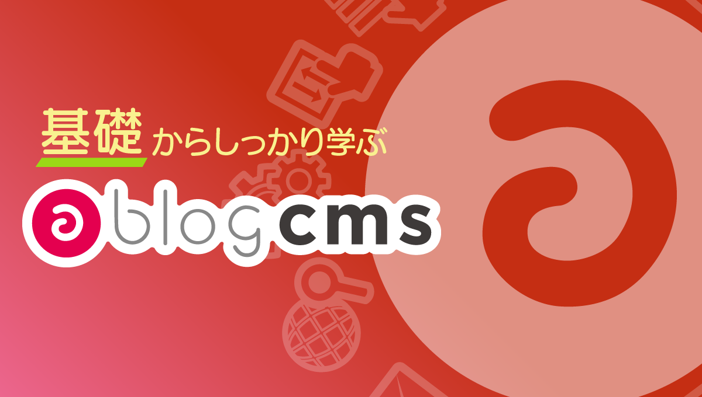
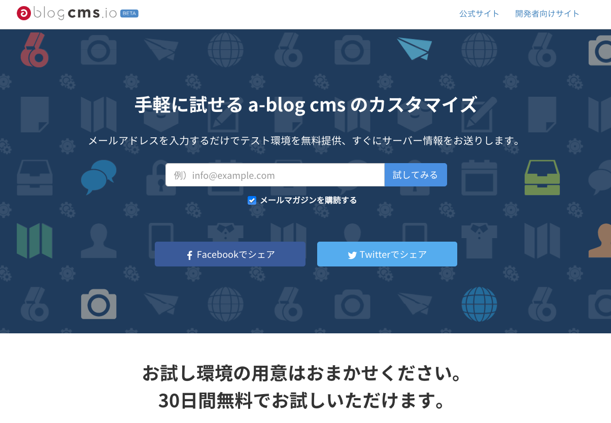

# はじめに

a-blog cms は2009年6月にリリースされました。当初は「Web制作者が、より便利で簡単にカスタマイズできる」というコンセプトで開発されましたが、進化を重ね、クライアント側にも使いやすいインターフェースも提供できるシステムとなりました。

Ver.2.0以降はプロフェッショナルライセンスやエンタープライズライセンスなどの承認機能が利用できるライセンス体系が増え、より多くの方々に利用していただけるようになっています。

2020年6月現在、北は北海道から南は九州まで日本全国640社ほどのWeb制作会社で採用いただいており、利用実績は3,700サイト以上となりました。公開事例として、570サイト以上を公式サイト上で紹介しています。

これまで、各地での勉強会やオンラインセミナーでお話した内容を文章にまとめたのが、この「**基礎からしっかり学ぶ a-blog cms**」です。a-blog cms に興味を持った方は、まず読む入門書としてご活用ください。

a-blog cmsのテストサーバーとして無料で利用いただける「[ablogcms.io](http://ablogcms.io)」も用意しております。本や入門ドキュメントで基本を学んでいただきながら、実際の使用感や動作はこちらの環境でお試しください。

